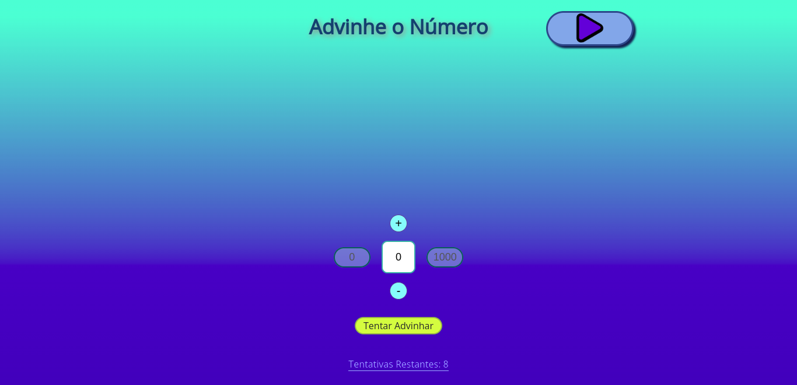
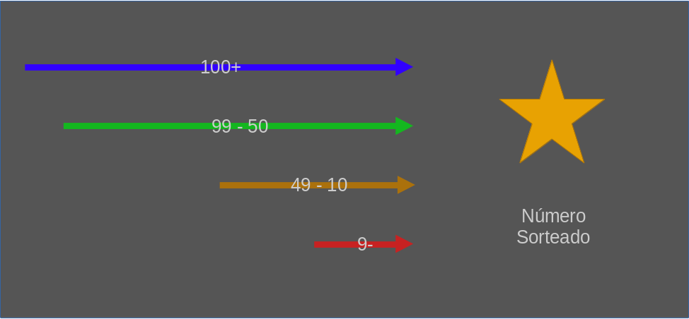

<h1> 
<p align="center"> MINI-GAME: ADIVINHE O NÚMERO 🎲 </p>

<p align="center"> 
    
    
    
</p>
</h1>

> &#x1F517; Link do Projeto:  
&#x27A1; https://sandrords.github.io/adivinhe-o-numero/

> Tipo de Projeto: *Pessoal* &#x1F4DA;

> Status do Projeto: *Versão 1 Completa* &#10004;&#x1F6A7;

## Descrição ##

O projeto consiste em uma espécie de Mini-Game da brincadeira infantil *"Tá quente, tá frio"*, porém, com números. Sendo assim, neste jogo de adivinhação e lógica você deverá descobrir um número aleatório, que foi selecionado entre 0 e 1000, através de algumas dicas que o jogo irá retornar ao longo das tentativas, indicando a distância que o jogador está do número correto.

<p align="center">

<br>
Interface do Jogo
</p>

## Regras do Jogo ##
### 1. Mensagens de Ajuda ###
O jogador possui **8 tentativas** para encontrar o número correto. Ao longo de cada tentativa, o jogo irá retornar uma mensagem indicando o quão longe o jogador está do número correto e se ele deveria diminuir ou aumentar o número da sua tentativa anterior.

**Ex.:**

*Número Sorteado: 789*

*Mensagem retornada ao tentar o número 550:*

```
    Você errou, que pena! Seu número é extremamente pequeno, aumente ele!
```

*Mensagem retornada ao tentar o número 795:*

```
    Você errou, que pena! Está quase lá, diminua ele apenas mais um pouco!
```

### 2. Caixas de Limite ###
Além das mensagens de ajuda, são mostradas duas caixas de limites para indicar os limites de maior e menor números possíveis descobertos até o momento. Os limites de menor e maior número iniciam como 0 e 1000, respectivamente, e vão sendo atualizados a medida que o jogador vai realizando suas tentativas. Junto a isto, as caixas mudam de cor para estimar a distância do número limite até o número sorteado.
<p align="center">
<br>

<br>
Esquema de Cores por Distância
</p>

## Ferramentas Utilizadas ##

* ***HTML*** e ***CSS***: Criação e estilização dos elementos da página
* ***JavaScript***: Funcionamento de todo algoritmo do jogo.

---
Made by &#128153; [SandroRDS](https://www.linkedin.com/in/sandro-rosa-de-souza-02a5bb241/) &#128153; | &#x1F47E; Mais Projetos: https://github.com/SandroRDS?tab=repositories
